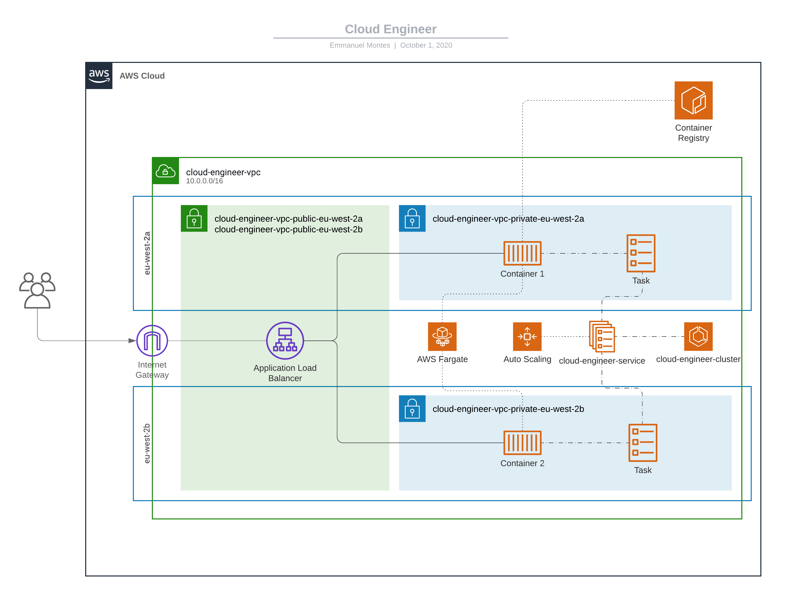

Cloud Engineer
==============

* **Author**: Emmanuel Ferreyra-Montes
* **Opportunity**: [cloud_engineer_for_cloud_engineering__.pdf](https://and-central.slack.com/files/URHCDEKTQ/F01BY8Y4KJL/cloud_engineer_for_cloud_engineering__.pdf)

## Tech Test
1. Terraform a load balanced web front end in AWS, GCP or Azure.
2. The solution should incorporate a number of elements
3. There should be a minimum of 2 instances, and they need to be able to scale across availability zones.
4. Ideally the web page should be secure.
5. The Vpc should be appropriately split into the required subnets.
6. The hosts should be running Linux and the choice of web server is down to the individual. The use of modules would be a good step but the focus should be on good terraform structure.

## Solution

#### Considerations
* Application load balanced across two different AZs
* Two initial instances/containers running in an ECS Cluster with Auto-scaling defined
* Autoscaling defined as follows:
    * Scaling out: 80% Threshold over 2 minutes - Adds 1 instance
    * Scaling in: 20% Threshold over 2 minutes - Removes 1 instance
    * Minimum 2 instances
    * Maximum 4 instances
* 443 HTTPS activated with a test certificate. For a production environment it should rather create a certificate or use an existing one with the domain required.
* Secured connection between ECS Containers, and the Application Load Balancer with restrictive a security group
* VPC split into 2 public subnets and 2 private subnets
* ECS Tasks using [tutum/hello-world](https://hub.docker.com/r/tutum/hello-world/) (based in Alpine) for testing purposes. In a real world scenario, if should consume the docker image ideally pushed in ECR or any other hub.

## Future considerations
* Automatically run repo with CI/CD pipeline (Github Actions, Gitlab CI/CD, AWS CodePipeline or any similar).
* User real case certificate for SSL
* Use CloudFront as CDN so content can be replicated in different edge locations for user low latency experience
* Incorporate AWS Shield for DDoS protection and AWS WAF to protect the application from common web exploits
* Usage of AWS Route 53 DNS to register the domain needed
* Incorporate other resources to the stack like databases 
